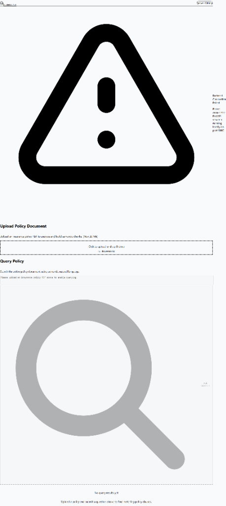

# Professional Insurance Policy Semantic Search & Retrieval System

A complete full-stack semantic search application designed to parse, clean, and retrieve highly relevant policy clauses from insurance agreements. Built using a local **Sentence Transformers** model (`all-MiniLM-L6-v2`), **NumPy**, and **Scikit-learn** for dense cosine similarity matching, with a **FastAPI** backend and **React** (Vite + Tailwind CSS) frontend.

This project demonstrates a production-grade document search and retrieval pipeline *without* relying on complex cloud-based vector databases, LangChain, or external LLM API endpoints.



---

## 🚀 Key Features

* **Advanced Line-Based Heading Chunker**: Redesigned document parser that splits text line-by-line, identifies numbered section boundaries (e.g., `3.51 Room Rent`, `4.3 Cataract Treatment`), and segments sections. Overly large sections are split into sub-chunks of max 400 words with headings automatically prepended to preserve retrieval context.
* **Multi-Stage Reranking Pipeline**:
  1. **Semantic Similarity**: Retrieves the Top-5 most relevant chunks from the embedding space.
  2. **Heading-Aware Boost**: Computes query similarity against section headings to filter out similarly worded clauses in unrelated sections (e.g., "Definitions" vs. "Exclusions").
  3. **Keyword-Overlap Scoring**: Extracts query keywords, removes stop words, and scores candidates based on keyword presence to handle compound medical queries.
  * *Final Score Formula*: $0.6 \times \text{Semantic Sim} + 0.2 \times \text{Heading Sim} + 0.2 \times \text{Keyword Overlap}$
* **Robust Text Cleaning**: Dynamically scans lines and filters out repeated page headers, footers, company names (e.g., "National Insurance Co."), policy names ("Arogya Sanjeevani"), page numbering, and UIN/IRDAI codes.
* **Split-Word Repair**: Corrects character separation artifacts introduced during PDF parsing (e.g., `Hospi talization` $\rightarrow$ `Hospitalization`, `t reatment` $\rightarrow$ `treatment`) while dynamically preserving original case formatting.
* **Sentence-Level Context Extraction**: Splits the best matching chunk into individual sentences, identifies the highest-scoring match to return as `highlighted_sentence`, and surrounds it with immediately adjacent sentences for context.
* **Premium UX Layout**: Includes drag-and-drop document upload with client-side checks, server-to-client progress indicator, connection status warning banner, clickable search queries suggestions, low similarity warning badges, and safe React mark highlights.

---

## 🛠️ Technology Stack

### Backend
* **Python 3.10+**
* **FastAPI**: Asynchronous REST framework
* **Sentence Transformers**: `all-MiniLM-L6-v2` dense embedding generation (eagerly loaded at server startup)
* **Scikit-learn**: Pairwise Cosine Similarity computation
* **PyPDF2**: Document stream extractor
* **NumPy**: Numeric vectors operations

### Frontend
* **React 19 (Vite)**: Component runtime
* **Tailwind CSS v4**: Modern, premium styling
* **Axios**: Promised-based HTTP client

---

## 🏛️ System Architecture & Retrieval Pipeline

The system retrieves target text chunks using the following deterministic processing flow:

```
[ PDF Upload ]
      │
      ▼
[ PDF Validation ] (Format, Corruption, Empty layers, Size < 20MB)
      │
      ▼
[ Text Extraction ] (Page-by-page parsing using PyPDF2)
      │
      ▼
[ Text Cleaning ] (Header/Footer filters, UIN deletion, Line cleaning)
      │
      ▼
[ Word Repairing ] (Re-joining split words like "t reatment" -> "treatment")
      │
      ▼
[ Heading Chunker ] (Line-based section boundaries and heading metadata mapping)
      │
      ▼
[ Embedding Generation ] (Model normalization: normalize_embeddings=True)
      │
      ▼
[ Cosine Similarity ] (Computing 0.6 * chunk score against query vector)
      │
      ▼
[ Heading-Aware Rerank ] (Adding 0.2 * heading similarity score)
      │
      ▼
[ Keyword-Overlap Rerank ] (Adding 0.2 * keyword match score)
      │
      ▼
[ Sentence Highlight ] (Sentence encoding & context retrieval)
      │
      ▼
[ Frontend Result ] (Render text inside JSX <mark> nodes)
```

---

## 📂 Folder Structure

```
.
├── backend/
│   ├── app.py                  # Entrypoint for FastAPI app
│   ├── routes.py               # REST API route handlers
│   ├── models.py               # Pydantic schemas (QueryRequest, QueryResponse, etc.)
│   ├── pdf_processor.py        # PDF text extraction, cleaning, and line-based heading chunker
│   ├── embedding_service.py    # Model caching and embeddings generation
│   ├── semantic_search.py      # Cosine similarity and multi-stage reranking (Heading + Keyword Overlap)
│   ├── utils.py                # Helper utilities and folders builder
│   ├── verify_semantic_search.py# Automated pipeline evaluation script
│   └── requirements.txt        # Python backend package dependencies
├── frontend/
│   ├── package.json            # npm package descriptors
│   ├── vite.config.js          # Vite tool configuration
│   ├── index.html              # HTML DOM shell
│   ├── src/
│   │   ├── main.jsx            # React root component initializer
│   │   ├── App.jsx             # React router container
│   │   ├── index.css           # Global stylesheet with Tailwind CSS
│   │   ├── pages/
│   │   │   └── Home.jsx        # Dashboard layout and states management
│   │   ├── components/
│   │   │   ├── Navbar.jsx      # Top menu and service status indicators
│   │   │   ├── UploadBox.jsx   # PDF dropzone and validation UI
│   │   │   ├── QuestionBox.jsx # Search field and click suggestions tags
│   │   │   └── AnswerCard.jsx  # retrieved text card and disclaimers
│   │   └── services/
│   │       └── api.js          # Axios API wrappers
│   └── .gitignore              # Node ignore definitions
└── .gitignore                  # Project root gitignore definitions
```

---

## 🔧 Installation & Local Setup

### Prerequisites
* **Python 3.10+**
* **Node.js 18+**

### 1. Setup Backend Server
1. Clone the repository and navigate to the project directory:
   ```bash
   cd Insurance-checker
   ```
2. Create and activate a python virtual environment:
   ```bash
   python -m venv .venv
   
   # Windows (PowerShell):
   .venv\Scripts\Activate.ps1
   
   # macOS / Linux:
   source .venv/bin/activate
   ```
3. Install the dependencies:
   ```bash
   pip install -r backend/requirements.txt
   ```

### 2. Setup Frontend Assets
1. Navigate into the frontend folder:
   ```bash
   cd frontend
   ```
2. Install npm dependencies:
   ```bash
   npm install
   ```

---

## 🏃 Running the Application

### 1. Launch FastAPI Server
From the project root directory, run:
```bash
# Windows (PowerShell)
.venv\Scripts\Activate.ps1
uvicorn backend.app:app --reload --port 8000
```
* The API server will be available at [http://localhost:8000](http://localhost:8000).
* The Sentence Transformers model will load eagerly on startup.
* Set `DEBUG=true` in your environment variables to enable query-rerank terminal logs and `/inspect_chunks`.

### 2. Launch Vite Frontend
From the `frontend` folder, run:
```bash
npm run dev
```
* The client dashboard will be available at [http://localhost:5173](http://localhost:5173).

---

## 📡 API Endpoints

### `GET /health`
Verifies server health and checks whether the Sentence Transformer model is loaded in memory.
* **Response**:
  ```json
  {
    "status": "ok",
    "model_loaded": true,
    "document_uploaded": true
  }
  ```

### `POST /upload`
Uploads and parses a PDF document. Generates page mappings, heading labels, and caches vectors.
* **Request Header**: `multipart/form-data`
* **Response**:
  ```json
  {
    "message": "Successfully processed 'arogya_policy.pdf'. 28 chunks cached."
  }
  ```

### `POST /query`
Performs multi-stage retrieval against document vectors and returns matching clause coordinates.
* **Body Schema**:
  ```json
  {
    "question": "Pre-existing disease waiting period"
  }
  ```
* **Response**:
  ```json
  {
    "status": "success",
    "answer": "3.2 Waiting Period Pre-existing disease waiting period of 36 months applies from the inception of the policy. Specific diseases list waiting period of 24 months.",
    "highlighted_sentence": "Pre-existing disease waiting period of 36 months applies from the inception of the policy.",
    "page": 20,
    "similarity": 71.36,
    "message": null
  }
  ```

### `DELETE /reset`
Wipes the active caches and clears temporary session configurations.
* **Response**:
  ```json
  {
    "message": "System has been reset. All caches cleared."
  }
  ```

---

## 📝 Example Queries to Try
Once your insurance policy PDF is uploaded, use the suggestion tags or type in:
1. **Pre-existing disease waiting period** (returns section 3.2 or equivalent waiting terms)
2. **Room rent limit** (returns room rent limits or sub-limits clauses)
3. **Ambulance charges** (returns emergency road transportation expenses)
4. **Domiciliary hospitalization** (returns home care treatment terms)

---

## ⚠️ Current Limitations
* **No OCR (Optical Character Recognition)**: The PDF parsing layer handles text extraction from searchable documents. Scanned or image-only PDFs are not supported.
* **In-Memory Cache Lifecycle**: Policy embeddings are cached in memory (RAM). Server restarts clear active document vectors, requiring re-uploading (ideal for single-session data inspection).
* **Document Size Scaling**: Extremely large documents (thousands of pages) may suffer from search overhead. For larger volumes, a native index engine like FAISS is recommended.

---

## 🔮 Future Improvements
* **FAISS Vector Indexing**: Integrate FAISS for lightning-fast query lookups on documents with thousands of sections.
* **OCR Layer**: Add Tesseract support to parse scanned images or image-only PDF uploads.
* **Multi-Document uploads**: Query across multiple active policies simultaneously.

---

## 📄 License
Distributed under the MIT License. See `LICENSE` for more information.
